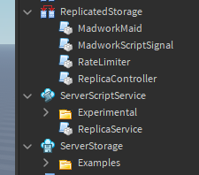
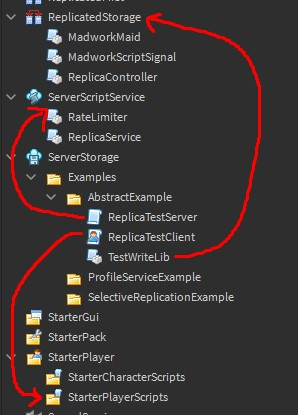

ReplicaService is a collection of module scripts. Your goal is to make your project have these files in the correct containers
("Experimental" and "Examples" folders are optional):

### Option #1: Get ReplicaService from the Roblox library

   - Get the library model [here](https://www.roblox.com/library/6015318619/ReplicaService)
   - Move all modules to the correct containers to match the image above

### Option #2: (Advanced users) Rojo

   - The ReplicaService package has Rojo configurations - download the 
[ReplicaService repository](https://github.com/MadStudioRoblox/ReplicaService)
   - Sync project with Rojo. If it's your first time using Rojo, [here's a tutorial](https://www.youtube.com/watch?v=Cnzf-q8OKGY)

### Running examples:
Select an example and move it's files accordingly:

It should work when you play solo (or online, or offline with multiple players).
Try joining with one player and then see what happens when you join with another player
while running these tests.

These tests are designed to be ran one at a time and will most likely interfere with
an existing codebase that uses ReplicaService due to them calling
[ReplicaController.RequestData()](/ReplicaService/api/#replicacontrollerrequestdata) - 
this method should only be called once in the entire codebase (See API for more info).